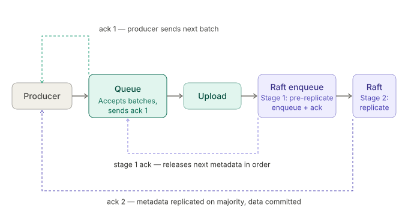

# Cloud Topics

Streaming data replication via S3

<br>

**Tyler Rockwood**

---

# What is Redpanda?

A **Kafka-compatible** streaming data platform built from the ground up in C++

- Drop-in replacement for Apache Kafka — same API, no JVM
- **Thread-per-core** architecture (Seastar) — no context switching, no GC pauses
- **Raft consensus** for every partition — strong consistency & fault tolerance
- **Tiered Storage** — offload historical data to object storage

<br>

> A fault-tolerant transaction log for storing event streams

---

# Redpanda Broker Architecture

```
Redpanda Node
┌────────────────────────────────────────────────────────────────┐
│  Kafka API layer                                               │
│ ┌─────────────────┐ ┌─────────────────┐ ┌─────────────────┐    │
│ │  Kafka handler  │─┼─► route to shard│ │  Kafka handler  │    │
│ │  Partition rtr  │ │                 │ │  Partition rtr  │    │
│ └────────┬────────┘ └─────────────────┘ └─────────┬───────┘    │
│          │            inter-shard msgs            │            │
│  Raft / Consensus layer                           │            │
│ ┌────────┴────────┐                   ┌───────────┴─────────┐  │
│ │  Raft group     │                   │  Raft group         │  │
│ │  Leader elect.  │                   │  Leader elect.      │  │
│ │  Metadata cache │                   │  Metadata cache     │  │
│ └────────┬────────┘                   └───────────┬─────────┘  │
│  Storage layer                                    │            │
│ ┌────────┴────────┐                   ┌───────────┴─────────┐  │
│ │  Log storage    │                   │  Log storage        │  │
│ └─────────────────┘                   └─────────────────────┘  │
│       Core 0            · · ·                Core N            │
└────────────────────────────────────────────────────────────────┘
```

Each core shares nothing with other cores, the have their own memory
and communicate via message passing.

---

# Redpanda Cluster Architecture

```
                  ┌───────────────────────────────────────┐
Producers ──────► │           Redpanda Cluster            │ ◄── Consumers
(Kafka API)       │                                       │     (Kafka API)
                  │  ┌─────────┐ ┌─────────┐ ┌─────────┐  │
                  │  │ Node 1  │ │ Node 2  │ │ Node 3  │  │
                  │  │         │ │         │ │         │  │
                  │  │ P0(L)   │ │ P0(F)   │ │ P0(F)   │  │
                  │  │ P1(F)   │ │ P1(L)   │ │ P1(F)   │  │
                  │  │ P2(F)   │ │ P2(F)   │ │ P2(L)   │  │
                  │  └─────────┘ └─────────┘ └─────────┘  │
                  └───────────────────────────────────────┘
                                    │
                             Tiered Storage
                                    ▼
                          ┌─────────────────┐
                          │ Object Storage  │
                          │  (S3 / GCS)     │
                          └─────────────────┘
```

Each partition is a **Raft group** — one leader (L), multiple followers (F)

---

# The Raft Replication Tax

Every produce request replicates data across availability zones via Raft

```
                     AZ-1           AZ-2           AZ-3
                  ┌────────┐    ┌────────┐    ┌────────┐
  Producer ──►    │ Node 1 │───►│ Node 2 │    │        │
                  │  (L)   │─────────────────►│ Node 3 │
                  └────────┘    └────────┘    └────────┘
                       Cross-AZ Network Traffic 💸
```

<br>

- Cloud providers charge for **cross-AZ data transfer**
- At high write throughput, networking is **70–90%** of total cost
- Every byte of data crosses the network **twice** (to each follower)

---

# Why Cloud Topics?

**What if we could skip the cross-AZ replication tax?**

<br>

| | Standard Topics | Cloud Topics |
|---|---|---|
| **Data replication** | Raft (cross-AZ network) | Object storage (S3/GCS) |
| **Latency** | Single-digit ms | Sub-second |
| **Cost driver** | Network transfer | Storage PUTs/GETs |
| **Ideal for** | Low-latency trading, real-time | Logs, analytics, CDC, high-throughput |

---

# Cloud Topics: The Key Idea

Separate **where metadata is stored** from **where data is stored**

```
  Standard Topic:    Data + Metadata ──► Raft Log (local disk, replicated)

  Cloud Topic:       Data ────────────► Object Storage (S3/GCS)
                     Metadata ─────────► Raft Log (local disk, replicated)
```

<br>

- Data goes directly to object storage — **no cross-AZ replication**
- Only lightweight metadata (pointers) go through Raft
- Same **transactions & idempotency** guarantees — Raft still handles correctness

---

# The 30,000-Foot View

```
                     ┌───────────────────────────────────────┐
  Producer ────►     │           Redpanda Broker             │
                     │                                       │
                     │  1. Batch in memory                   │
                     │  2. Upload to Object Storage (L0)     │──► Object Storage
                     │  3. Write placeholder to Raft         │       (L0 Files)
                     │  4. ACK to producer                   │          │
                     │                                       │     Reconciler
                     │  Raft Log                             │          │
                     │  ┌───────────────────────┐            │          ▼
                     │  │ ptr │ ptr │ ptr │ ... │            │     (L1 Files)
                     │  └───────────────────────┘            │
                     │                                       │
  Consumer ◄────     │  Read from cache / L0 / L1            │◄── Object Storage
                     └───────────────────────────────────────┘
```

---

# Step 1: The Write Path

Optimized for fast, cheap ingest

```
  Producer
     │
     ▼
  Kafka API Layer
     │
     ▼
  Cloud Topics Subsystem
     │
     ├──► Batch in memory (time window ~0.25s OR size ~4MB)
     │    Batches across ALL partitions and topics
     │
     ▼
  Upload batch to S3 ──────────────────────► L0 File
     │
     ▼
  Write placeholder to Raft Log
  (filename + offset per partition)
     │
     ▼
  ACK to Producer ✓
```

Batching across partitions **minimizes PUT requests** to object storage

---

# Write Path: Strong Consistency

**How do transactions and idempotency work?**

The placeholder batch reuses the **normal produce path** through Raft

```
  ┌─────────────────────────────────────────────────┐
  │                    Raft Log                     │
  │                                                 │
  │  [batch 0] [batch 1] [placeholder] [batch 3] ...│
  │                          │                      │
  │                     points to L0                │
  │                     file in S3                  │
  └─────────────────────────────────────────────────┘
```

<br>

- Transactions and Idempotency: handled using the exact same raft state machine as normal topics

---

# Step 2: The Reconciler

L0 files are optimized for **writes** — they contain small chunks of data from many partitions

```
  L0 File
  ┌───────────────────────────────┐
  │ TopicA-P0 │ TopicB-P1 │ ...   │   ◄── Scattered reads
  └───────────────────────────────┘
  ┌───────────────────────────────┐
  │ TopicB-P1 │ TopicC-P0 │ ...   │   ◄── Scattered reads
  └───────────────────────────────┘
```

The **Reconciler** reorganizes L0 → L1 in the background

```
  L1 File
  ┌────────────────────────────────────────────┐
  │ TopicA-P0: offset 0 │ 1 │ 2 │ 3 │ ...      │   ◄── Sequential reads
  └────────────────────────────────────────────┘
```

L1 files are: **larger**, **co-located** by partition, **sorted** by offset

---

# L0 vs L1 Storage

```
                    Write-optimized           Read-optimized
                    ┌───────────┐             ┌───────────┐
                    │    L0     │  Reconcile  │    L1     │
  Producers ──►     │           │ ──────────► │           │ ──► Historical
                    │           │             │           │     Consumers
                    └───────────┘             └───────────┘
                                                   │
                                             Metadata stored
                                             in KV store
                                             (internal topic)
```

---

# Step 3: The Read Path

Reads are routed based on the **Last Reconciled Offset**

```
  Partition offset space:

  ◄──────── L1 (Reconciled) ────────┼──── L0 / Cache ────►
  0                          Last Reconciled            HEAD
                              Offset
```

<br>

- **Tailing consumers** (most workloads): read from **memory cache** — low latency
- **Recent offsets** (> Last Reconciled): follow Raft log pointers → **L0 files**
- **Historical offsets** (< Last Reconciled): read from **L1 files** — large sequential reads

---

# Putting It All Together

```
                          Object Storage
                    ┌──────────────────────────┐
                    │  L0 Files  │  L1 Files   │
                    └──────▲──────────▲────────┘
                           │          │
               Upload ─────┘          │ Reconcile
                    │                 │
  ┌─────────────────┴─────────────────┴───────────────┐
  │                   Redpanda Broker                 │
  │                                                   │
  │  Write Path          Reconciler        Read Path  │
  │  • Batch             • L0 → L1         • Cache    │
  │  • Upload L0         • Compact          • L0 read │
  │  • Raft placeholder  • GC old L0        • L1 read │
  └───────────▲───────────────────────────────┬───────┘
              │                               │
         Producers                       Consumers
```

---

# Project Timeline



---

# LSM Tree KV Store

Built the metadata storage engine for Cloud Topics

- Existing Tiered Storage used a bespoke metadata management stored per partition
- Needed a scalable metadata store for L1 file tracking for all cloud topics
- Took a bet and ported LevelDB (with optimizations) to seastar
- Integrated with Raft consensus for replication
- Backed by object storage for disaster recovery
- Designed a mechanism to prevent different leaders from writing conflicting files

---

# Producer Optimizations

We were running into issues scaling from 100MB/s → 1GB/s



---

# Producer Optimizations

This removed the bottleneck and we could push multiple GB/s easily



---

# Cluster Epoch System

- L0 files contain data for multiple partitions
- There is no source of truth for what files exist
- It is undesirable to explicitly track temporary L0 files
- Solution was to have a cluster epoch associated with each L0 file
- Now each partition would enforce strictly increasing cluster epoch for metadata at ingestion time
- Reconcilation would track the epoch that it had processed and all lower epoch values could be GC'd
- This initial approach had some issues so we had to introduce a window of epoch values we would accept

---

# Questions?
